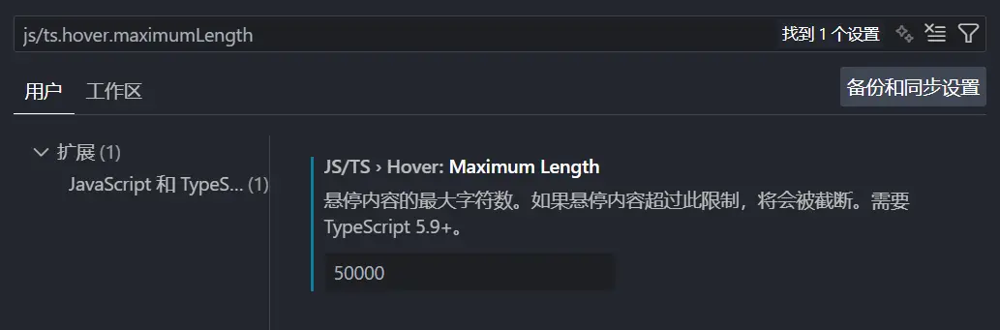

最近在写项目遇到了一些巨大 TypeScript 类型，想要查看类型的具体结构，但沟槽的 VSCode 默认只显示一小部分内容，并用省略号 `...` 代替剩余部分：


给我恶心坏了，VSCode 没法展开这个类型，因为语言服务器就是这么返回的。。。

经过一番 Google `vscode typescript展开`，发现了一个[解决方案](https://segmentfault.com/a/1190000043495782)。

然而 2023-03-03 的文章已经过时了，而且解决方法也很 Hacky（直接修改工作空间的 ts 服务器脚本）。不过这篇文章提供了[对应 issue](https://github.com/microsoft/vscode/issues/64566)。

~~这玩意都快 8 年了居然还没关。。~~

很可惜，这个 issue 仍然没法解决我的问题。再重新看那个硬编码的解决办法对应的文件（还是看这个 issue 评论区知道的[文件更改](https://github.com/microsoft/vscode/issues/64566#issuecomment-2376295783)），顺着这个 `defaultHoverMaximumTruncationLength` 找到了另一个变量 `maximumLength`，这玩意比前面那个优先级更高。ctrl+左键查看定义，发现 `getQuickInfoAtPosition` 函数，顺着它终于找到最关键的部分：

```js
const quickInfo = project.getLanguageService().getQuickInfoAtPosition(
	file,
	this.getPosition(args, scriptInfo),
	userPreferences.maximumHoverLength,
	args.verbosityLevel,
);
```

这个 `userPreferences.maximumHoverLength` 一看就是什么 VSCode 里应该有的配置，于是返回 GitHub 搜索，得到 [#248181](https://github.com/microsoft/vscode/pull/248181)，今年 5 月刚合并的 PR，终于啊！

在这个 PR 的 diff 里得到 `js/ts.hover.maximumLength`，改大这个就可以完美解决这个问题了，爽。


